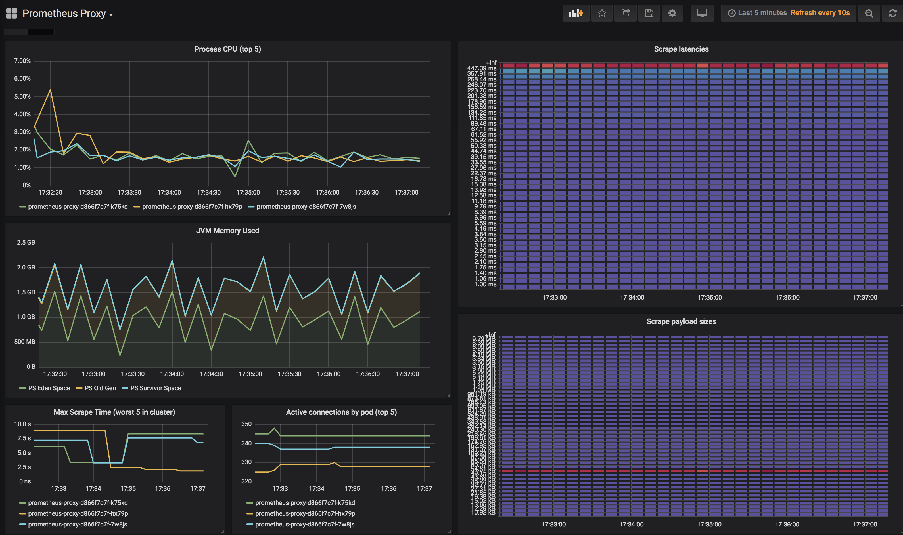

[](https://circleci.com/gh/micrometer-metrics/prometheus-rsocket-proxy)

# Prometheus RSocket Proxy

This is a collection of resources to help you get application metrics to Prometheus when you cannot open ingress into your application while still preserving the pull model, using [RSocket](https://rsocket.io) bidirectional persistent RPC.

## Basic operation

The approach works like this:

1. An application makes a TCP RSocket connection to an RSocket proxy or cluster of proxies (the connection is effectively delegated by the load balancer to some instance/pod in the proxy cluster). Once the RSocket connection is established, the distinction between "server" and "client" disappears, so the proxy is able to act as the requester when pulling metrics from each application instance.
2. Prometheus is configured to scrape the `/metrics/connected` and `/metrics/proxy` endpoints of the proxy(ies) and not the application instances.
3. When the proxy receives a scrape request from Prometheus, it pulls metrics from each RSocket connection using a [request/response](http://rsocket.io/docs/Protocol#stream-sequences-request-response) sequence. The results of each connection are concatenated into one response for presentation to Prometheus.

The proxy sends a public key to the application instance for it to encrypt the metrics payload on each scrape.

Clients automatically reconnect, so the bidirectional connection doesn't have to be durable over a long period of time for metrics to still get out. Because clients reconnect, the proxy cluster itself can be configured to horizontally autoscale or rebalance connections without fear of disrupting connected applications.

## Use in application code

Include the dependency (only in JCenter until 1.0 GA):

```
implementation 'io.micrometer.prometheus:prometheus-rsocket-client:VERSION'
```

or

```
<groupId>io.micrometer.prometheus</groupId>
<artifactId>prometheus-rsocket-client</artifactId>
<version>VERSION</version>
```

### Manually configuring

```java
PrometheusMeterRegistry meterRegistry = new PrometheusMeterRegistry(PrometheusConfig.DEFAULT);

PrometheusRSocketClient client = new PrometheusRSocketClient(meterRegistry,
      TcpClientTransport.create("proxyhost", 7001),
      c -> c.retryBackoff(Long.MAX_VALUE, Duration.ofSeconds(10), Duration.ofMinutes(10)));

// it isn't strictly necessary to close the client
client.close();
```

### Spring Boot auto-configuration

Include the following dependency (only in JCenter until 1.0 GA):

```groovy
implementation 'io.micrometer.prometheus:prometheus-rsocket-spring:VERSION'
```

or

```xml
<groupId>io.micrometer.prometheus</groupId>
<artifactId>prometheus-rsocket-spring</artifactId>
<version>VERSION</version>
```

This will autoconfigure the Micrometer `PrometheusMeterRegistry`, a `PrometheusRSocketClient`, and a call to `pushAndClose` on application shutdown. The client will be configured to retry failing connections to the proxy. Retrying can be tuned with:

```yml
management.metrics.export.prometheus.rsocket:
  host: YOURPROXYHOSTHERE #required
  port: 7001
  max-retries: 10000 # default is Long.MAX_VALUE
  first-backoff: 10s
  max-backoff: 10m
```

## Support for short-lived or serverless applications

Use `pushAndClose()` on the `PrometheusRSocketClient` in a shutdown hook for short-lived and serverless applications. This performs a [fire-and-forget](http://rsocket.io/docs/Protocol#stream-sequences-fire-and-forget) push of metrics to the proxy, which will hold them until the next scrape by Prometheus. In this way, you do not need to set up [Pushgateway](https://github.com/prometheus/pushgateway). The same RSocket proxy serves the needs of both long-lived and short-lived applications.

```java
PrometheusRSocketClient client = new PrometheusRSocketClient(meterRegistry,
      TcpClientTransport.create("proxyhost", 7001),
      c -> c.retryBackoff(Long.MAX_VALUE, Duration.ofSeconds(10), Duration.ofMinutes(10)));

// in a shutdown hook
client.pushAndClose();
```

## Installing on Kubernetes (GKE)

This installation includes Prometheus and Grafana as well.

1. `kubectl apply -f scripts/kubernetes/proxy/` (`kubectl get svc -n monitoring-tools` to see external IP)
1. `kubectl apply -f scripts/kubernetes/prometheus/`
3. `kubectl apply -f scripts/kubernetes/grafana`

## Expected performance

A 3-pod deployment easily handles 1,000 connected application instances each serving 1,000 distinct time series with <1vCPU and <3Gi RAM total on GKE.



The scrape performance for each pod is <3s per interval.
